# Design System

Visual identity, theming, typography, and interactive elements.

```mermaid
flowchart TD
    classDef done fill:#4a7c59,color:#fff,stroke:#4a7c59
    classDef inprogress fill:#c8b89a,color:#1a1916,stroke:#c8b89a
    classDef todo fill:#5a5750,color:#e8e4dc,stroke:#5a5750
    classDef blocked fill:#8b3a3a,color:#fff,stroke:#8b3a3a

    CSSVars[CSS Variables / Tokens]:::done
    DarkTheme[Dark Theme]:::done
    LightTheme[Light Theme]:::done
    SystemPref[System Preference Detection]:::done
    ThemeToggle[Theme Toggle Button]:::done
    Typography[Typography - Instrument Serif + DM Mono]:::done
    CustomCursor[Custom Cursor + Ring]:::done
    GridOverlay[Grid Overlay]:::done
    ScanlineEffect[Scanline Animation]:::done
    NoiseTexture[Noise Texture]:::done
    FadeAnimations[Fade-up Animations]:::done
    ResponsiveLayout[Responsive / Mobile]:::inprogress
    ProseStyles[Prose Styles for Content]:::done

    CSSVars --> DarkTheme
    CSSVars --> LightTheme
    SystemPref --> ThemeToggle
    Typography --> ProseStyles
    class SystemPref blocked
    class CustomCursor inProgress
    class ProseStyles inProgress
    class ScanlineEffect inProgress
```

## ResponsiveLayout

Basic mobile breakpoint at 640px exists (hides decorative elements, reduces padding). No tablet breakpoint. Custom cursor is hidden via CSS on touch but `cursor: none` on body may cause issues on mobile.
