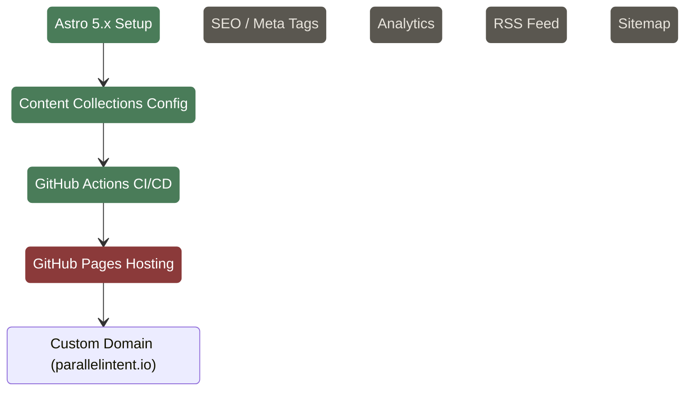

# Infrastructure

Build tooling, deployment, and hosting configuration.

## SEO

Only a `<title>` tag exists. No meta description, Open Graph tags, or structured data.

## Analytics

No analytics integration. Consider PostHog or simple analytics.

## RSS

No RSS feed configured. Astro has built-in RSS support via `@astrojs/rss`.

## Sitemap

No sitemap generation. Astro has `@astrojs/sitemap` integration available.
