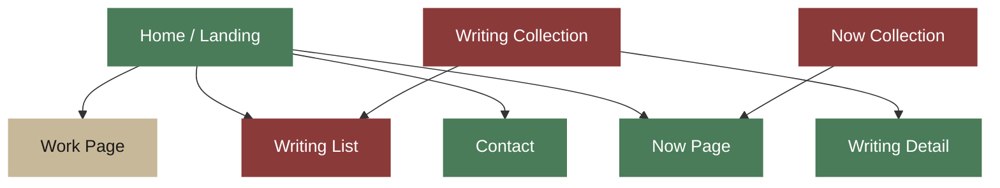

# Pages & Content

Site pages and content collections for parallelintent.io.

## Work

Two sections added:
- **Orbs** (open source) — small self-contained tools, links to GitHub org
- **Waves** (aligned workflows) — the operating layer between human judgment and machine speed. Status: in progress.

## WritingCollection

Only one post exists ("Aligned at the source", status: seed). Collection schema supports seed/growing/evergreen statuses and tags — infrastructure is ready, needs more content.

## Contact

Implemented as a mailto link in Nav (k@parallelintent.io). No contact form.
